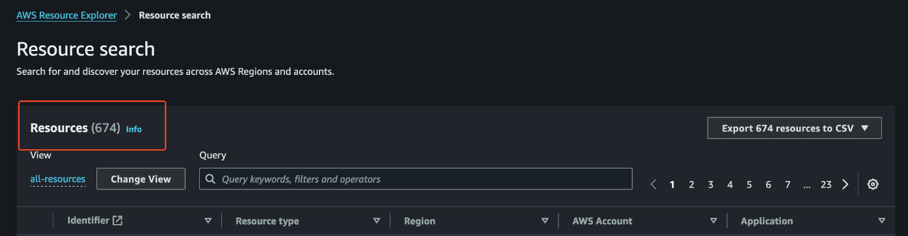

## How Amazon Resource Explorer Gave Me a Mini Heart Attack 💔

I learned about an AWS service that gave me a mini heart attack. 
It's none other than [Amazon Resource Explorer](https://docs.aws.amazon.com/resource-explorer/latest/userguide/welcome.html). 
It's a free service to discover all resources across regions and accounts.

After enabling the service, it started to index the resources. About 10 minutes later, 
the default view displayed around 600+ 🤯 resources in all 17 regions that are enabled by default. 
Some resources had been created in regions I had never switched to in the console.

I initially thought my account had been compromised and someone had created all these resources everywhere. 
However, I had all the safeguards to secure the account to the best of my knowledge. 
Additionally, my AWS bills never exceeded $2, and I had set up a budget alert for when it crossed $1. 
So, I didn't panic too much 😜, but seeing some resources with the following configurations was a bit scary. 😳

So, I slowly started digging into these resources to understand their use. I knew each region had the VPC enabled by default, 
but I didn't know much about the resources associated with them. There were several resources related to Redis, ElastiCache, Athena, etc. 
To make it more confusing, the resource count was inconsistent across regions I had never used.

In the end, I managed to understand that all of these resources, except the ones I created, were created by AWS by default. 
The info help sidebar was helpful in understanding them, and many of them can’t be deleted as well.

That’s my story.
