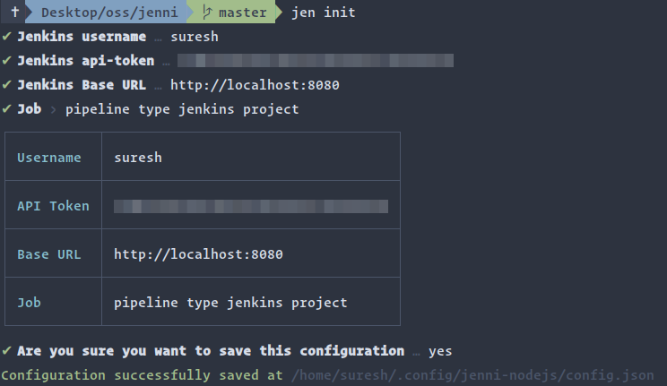
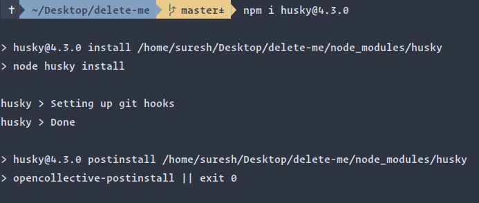

## Gracefully clean up configuration files in Node.js based CLI applications

It's common in CLI applications to store app configurations such as settings, 
preferences in the user's file system. There are many libraries available 
to make this process much easier than ever. When an application persists 
its configurations in the user's file system, then it should also be 
responsible for removing them when it gets uninstalled.
But that's not always the case. The application may keep those configurations 
to provide better user experiences for future usages.

So a better option would be to let the user decide whether to keep the 
configurations or not. With this approach, the user aware that even if
the application gets uninstalled, there are going to be some files 
left in the file system.

In this article, I'd like to show you how I used NPM's life cycle 
hook, environment variable to interactively remove configuration 
file in a CLI application when it gets uninstalled.

### Let me introduce Jenni

[Jenni](https://github.com/m-sureshraj/jenni) is a Node.js based CLI 
application to interact with the Jenkins server. It requires a few 
inputs (Username, API token, etc.) from the user before it becomes 
usable. So after it gets installed, the first step is initializing it.



If the user confirms, then the collected inputs will get saved in the file system.
For us, the relevant part is the last line. The file name that Jenni 
uses to store those inputs.

```
/home/suresh/.config/jenni-nodejs/config.json
```

With this introduction, you have enough idea about the application.

### NPM lifecycle scripts

[Lifecycle](https://docs.npmjs.com/cli/v6/using-npm/scripts#life-cycle-scripts) scripts are special scripts that get executed under 
specific situations. As developers, we can hook into these scripts 
to perform different actions on different stages.

For example, [Husky](https://github.com/typicode/husky) uses the 
[postinstall](https://github.com/typicode/husky/blob/next/package.json#L36) 
lifecycle script to set up git hooks after it gets installed.



Jenni uses the `preuninstall` life cycle script to trigger the 
cleanup functionality. NPM executes this script before the 
package gets **uninstalled**.

```json
"scripts": {
  "preuninstall": "node src/scripts/pre-uninstall.js"
}
```

### Implementation

Here's the initial implementation of the `pre-uninstall.js`

```javascript
const fs = require('fs');
const path = require('path');

const Conf = require('conf');

const { getDeleteConfigConfirmation } = require('../lib/prompt');

async function deleteConfig() {
  ...
}

if (require.main === module) {
  deleteConfig().catch(console.error);
} else {  
  // for testing
  module.exports = deleteConfig;
}
```

The script starts with importing a couple of built-in Node.js 
modules (fs, path) then an NPM package called [`conf`](https://github.com/sindresorhus/conf) to manage 
local configs, and a function `getDeleteConfigConfirmation` to 
interactively get the user confirmation.

#### A note about `getDeleteConfigConfirmation`

```javascript
const prompts = require('prompts');

exports.getDeleteConfigConfirmation = function() {
  const question = {
    type: 'confirm',
    name: 'confirmation',
    message: 'Are you sure you want to delete the app configuration',
    initial: false,
  };

  return prompts(question);
};
```

Internally Jenni uses a library called [prompts](https://github.com/terkelg/prompts) to create 
interactive CLI prompts. (drop-down, confirmation, auto-complete, etc.) 
So for this use-case, It used `confirm` type prompt.

Let's skim through the last section before reviewing the `deleteConfig` 
implementation.

```javascript
if (require.main === module) {
  deleteConfig().catch(console.error);
} else {
  module.exports = deleteConfig;
}
```

The above condition is checking whether the script is running 
directly from Node.js. i.e.

```
> node ./pre-uninstall.js
```

or loaded from another module.

```javascript
// some.spec.js

const preUninstall = require('src/scripts/pre-uninstall.js');
...
```

The above approach provides a way to invoke the function 
directly while offering a way to export the function for testing.

The `deleteConfig` function implementation is pretty self-explanatory.

```javascript
async function deleteConfig() {
  const store = new Conf();
  const configFilePath = store.path;
  const configDirPath = path.dirname(configFilePath);

  try {
    const isConfigExists = fs.existsSync(configFilePath);

    if (isConfigExists) {
      const { confirmation } = await getDeleteConfigConfirmation();

      if (!confirmation) {
        console.log('\nWise choice! We will keep the app configuration for future use.');
        return;
      }

      fs.unlinkSync(configFilePath);
    }

    // This should run unconditionally because initializing `new Conf()` 
    // will implicitly create an empty directory if no config directory exists.
    fs.rmdirSync(configDirPath);

    if (isConfigExists) {
      console.log('\nThe app configuration has been successfully deleted.');
    }
  } catch (err) {
    console.log('\nFailed to delete the app configuration.');
    console.log(`Manually delete the following directory: ${configDirPath}\n`);
  }
}
```

In a nutshell, if the config file exists, the function prompts the user 
to get permission before removing it. If the user agrees to remove, then 
it deletes the config file and the directory. Else it simply prints a message.
After the function execution, NPM continues its uninstallation process.

### NPM environment variables

There is one catch with the `preuninstall` lifecycle script. 
It gets triggered when the package gets updated to a new version as well
(i.e. `npm update -g jenni`). But the config file should 
be cleaned up only when the package gets uninstalled explicitly 
(i.e `npm uninstall -g jenni`).

When you run an NPM command, it provides lots of information about
the current execution environment, lifecycle events, configs, etc. 
through [environment variables](https://docs.npmjs.com/cli/v7/using-npm/scripts#environment).

Here is a list of a few NPM specific environment variables from 
the `process.env`.

```
npm_package_scripts_prettier: 'prettier --config ./prettier.config.js --write',
npm_package_dependencies_ora: '^3.2.0',
npm_package_devDependencies_lint_staged: '^9.2.0',
npm_config_argv: '{"remain":["jenni"],"cooked":["uninstall","--global","jenni"],"original":["uninstall","-g","jenni"]}',
npm_config_long: '',
npm_config_production: '',
npm_config_searchlimit: '20',
npm_config_unsafe_perm: 'true',
npm_config_update_notifier: 'true',
npm_config_auth_type: 'legacy',
npm_config_node_version: '8.12.0',
npm_config_tag: 'latest',
...
```

The `npm_config_argv` environment variable's `original` property 
holds currently executed command. For example, when the package 
gets uninstalled explicitly:

```
> npm uninstall -g jenni

// process.env.npm_config_argv
npm_config_argv: '{"original":["uninstall","-g","jenni"]}'
```

When the package gets updated to a new version:

```
> npm update -g jenni

// process.env.npm_config_argv
npm_config_argv: '{"original":["update","-g","jenni"]}'
```

Based on the executed command, we can figure out which action 
triggered the script. If it's `uninstall`, then we can continue the 
cleanup phase, else skip it. Here is the modified version of 
the `deleteConfig` function.

```diff
- async function deleteConfig() {
+ async function deleteConfig(env = process.env) {
+  const argv = env.npm_config_argv || '{}';
+  const { original = [] } = JSON.parse(argv);

+  if (!original.includes('uninstall')) return;

   ...
}
```

### The cleanup phase in action


### Pulling it all together

```json
// package.json
"scripts": {
  "preuninstall": "node src/scripts/pre-uninstall.js"
}
```

```javascript
// src/scripts/pre-uninstall.js

const fs = require('fs');
const path = require('path');

const Conf = require('conf');

const { getDeleteConfigConfirmation } = require('../lib/prompt');

async function deleteConfig(env = process.env) {
  const argv = env.npm_config_argv || '{}';
  const { original = [] } = JSON.parse(argv);

  if (!original.includes('uninstall')) return;

  const store = new Conf();
  const configFilePath = store.path;
  const configDirPath = path.dirname(configFilePath);

  try {
    const isConfigExists = fs.existsSync(configFilePath);

    if (isConfigExists) {
      const { confirmation } = await getDeleteConfigConfirmation();

      if (!confirmation) {
        console.log('\nWise choice! We will keep the app configuration for future use.');
        return;
      }

      fs.unlinkSync(configFilePath);
    }

    fs.rmdirSync(configDirPath);

    if (isConfigExists) {
      console.log('\nThe app configuration has been successfully deleted.');
    }
  } catch (err) {
    console.log('\nFailed to delete the app configuration.');
    console.log(`Manually delete the following directory: ${configDirPath}\n`);
  }
}

if (require.main === module) {
  deleteConfig().catch(console.error);
} else {
  module.exports = deleteConfig;
}
```

You can find the actual implementation of `pre-uninstall.js` and 
the spec file in this [repository](https://github.com/m-sureshraj/jenni/tree/master/src/scripts).
