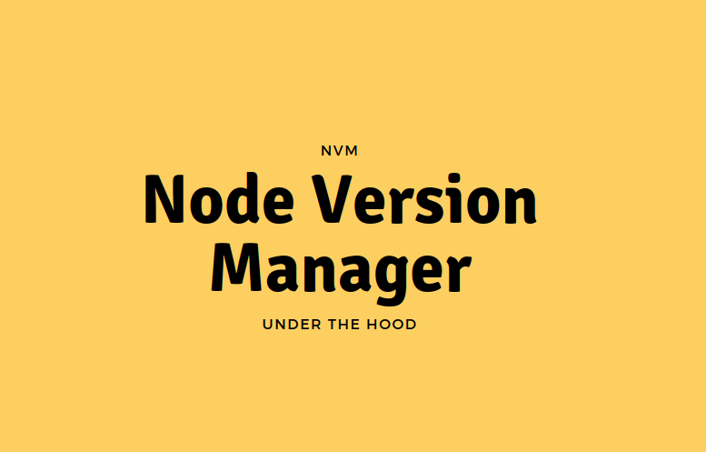

## Node Version Manager (NVM) under the hood
[Node Version Manager](https://github.com/nvm-sh/nvm) (NVM) is a popular open-source tool to manage multiple active Node.js versions.

Earlier this year (January 2021), I got the privilege to do my first public tech talk.
I presented "How **NVM works under the hood**" in the [Colombo JavaScript meetup](https://www.meetup.com/Colombo-JS-Meetup/).
The goal of this presentation is to explain how NVM manages multiple versions of Node.js internally.

Video › https://www.youtube.com/watch?v=yNn0JXXmYXA

Slides › https://www.canva.com/design/DAESy6DF8e4/BMoLF_Uf7Q_mMj-PpqOSUQ/view
