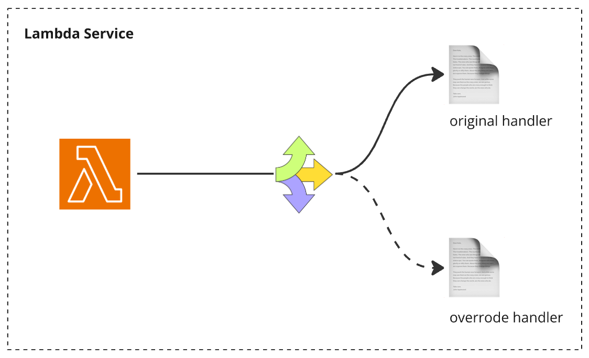
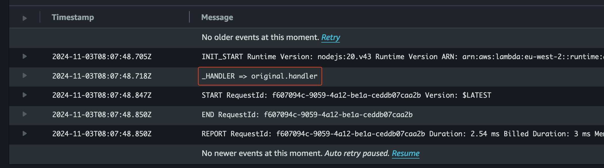
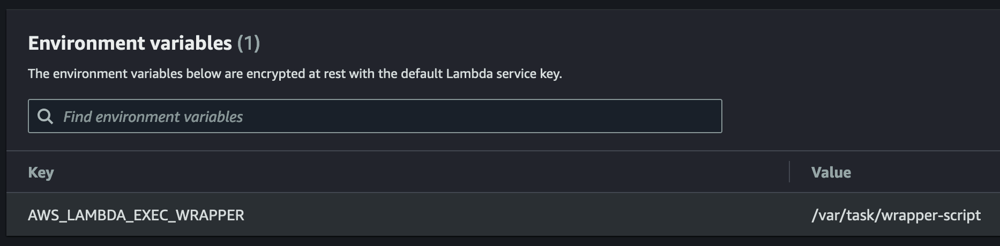
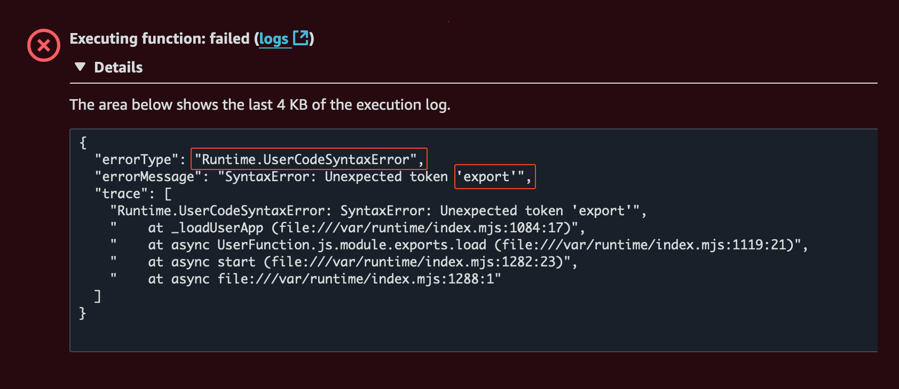
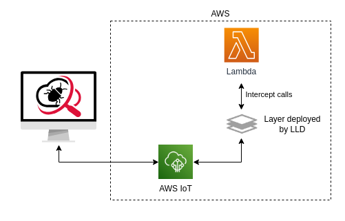

# AWS Lambda: Dynamically Overriding the Handler



I recently came across a technique for running a different Lambda handler 
than the one specified during deployment. I found it interesting, 
and it sparked my curiosity to understand how it works and the concept behind it.

This post aims to share how this technique works, along with some additional 
insights I learned during the investigation, specifically within the `Node.js` 
runtime in AWS Lambda. Let's get started!

<br>

## Lambda Environment Variables

Lambda runtime sets several [environment variables](https://docs.aws.amazon.com/lambda/latest/dg/configuration-envvars.html) during initialization. 
They provide information about the function and runtime.

### Reserved environment variables

The keys for these variables are [reserved](https://docs.aws.amazon.com/lambda/latest/dg/configuration-envvars.html#configuration-envvars-runtime) and can’t be set in the function configuration. 
Here are a few examples of the reserved variables.

```javascript
LAMBDA_TASK_ROOT: '/var/task', // The path to your Lambda function code.
_HANDLER: 'app.handler', // The handler location configured on the function.
AWS_LAMBDA_FUNCTION_NAME: 'the-name-of-the-function'
...
```

Lambda also sets some additional variables that are not reserved and can be 
overridden in the function configuration.

<br>

## Lambda Internal Extension

[Internal extension](https://docs.aws.amazon.com/lambda/latest/dg/runtimes-modify.html) is an option lambda provides 
to modify the runtime process. It provides two options for the modification:

- [Language-specific environment variables](https://docs.aws.amazon.com/lambda/latest/dg/runtimes-modify.html#runtimes-envvars) - Lambda provides a few env variables that can be set to pass options to the runtime.
    - For example, if the Lambda uses the `Node.js` as the runtime, then the `NODE_OPTIONS` environment variable can be used to pass certain configuration options to the process.

- [Wrapper Scripts](https://docs.aws.amazon.com/lambda/latest/dg/runtimes-modify.html#runtime-wrapper) - Lambda delegate the runtime startup to this script when it’s present.
    - The `AWS_LAMBDA_EXEC_WRAPPER` env variable is used to configure the location of script to the Lambda.
    - The startup behaviour of the lambda function can be customizable through this script.

> [!NOTE]  
> Internal lambda extension runs as part of the same runtime process. 
> In simpler terms, it just a way to alter the behaviour of the runtime by setting certain environment variables 
> or running a script that is responsible for initiating the runtime process. 
> Lambda also has external extension that has different use case and behaves differently. 
> Check out this [YouTube series](https://www.youtube.com/watch?v=vEYffPn4Mtc&list=PLJo-rJlep0ECO8od7NRdfJ4OrnQ7TMAwj&index=1) to learn more about Lambda extension in general.

<br>

## The Wrapper Script

When it presents Lambda uses the script to start the runtime (i.e Node.js, Python, or the configured 
[runtime](https://docs.aws.amazon.com/lambda/latest/dg/lambda-runtimes.html)). 
It passes the runtime's path and all original startup arguments to the script.

Here’s an example of arguments passed to a wrapper script of a Lambda configured with `Node.js` runtime.

```
/var/lang/bin/node 
  --expose-gc
  --max-http-header-size=81920
  --max-semi-space-size=17
  --max-old-space-size=922
  
  /var/runtime/index.mjs
```

> [!NOTE]
> Here the `/var/runtime/index.mjs` is not part of our codebase. 
> It’s the internal script that Lambda uses to load and run the handler code. 
> e.g. `app.handler`. — Though I couldn’t find any reference to this in AWS doc.

The wrapper script can alter the runtime's startup behavior, such as by setting or overriding environment variables, 
adding or modifying arguments, etc. In this case, we will utilize its ability to override environment variables 
to change the Lambda handler.

The script can be written in any language supported by the runtime, 
but it must have **executable permission** to allow Lambda to run it.

<br>

## Sample Application

The [sample-app](./sample-app) is built with the [Serverless Framework](https://www.serverless.com/) and deploys a Lambda 
function in `Node.js` with a wrapper script that overrides the original handler attached to the function.

These are the main files involved in the application:

```
├── ...
├── original.js
├── override.js
├── serverless.yml
└── wrapper-script
```

Let’s take a look at the serverless.yml file to understand how the application is configured.

```yaml
functions:
  demo:
    handler: original.handler
    environment:
      AWS_LAMBDA_EXEC_WRAPPER: /var/task/wrapper-script
    events:
      - httpApi:
          path: /
          method: get
```

It deploys an API Gateway endpoint connected to a Lambda function called `demo`. The Lambda function is configured 
to run the `handler` function from the `original.js` file when triggered.

The `AWS_LAMBDA_EXEC_WRAPPER` environment variable is configured with the file path where Lambda should look 
for the wrapper script.

> [!NOTE]
> The path points to the `/var/task/` directory because:
> - Within the execution environment, `/var/task` is where Lambda [extracts and mounts](https://docs.aws.amazon.com/lambda/latest/dg/nodejs-package.html#nodejs-package-searchpath) the deployed `.zip` package.
> - Since the `wrapper-script` is part of the deployed package, it is extracted into the same location. Hence, the environment variable is set to point to this location.
> - Lambda provides the location where the deployed code is extracted and mounted through the `LAMBDA_TASK_ROOT` environment variable.

The `wrapper-script` is written in bash. It simply logs the initial value of the `_HANDLER` environment variable and 
overrides it by pointing it to the handler function defined in the `override.js` file.

```bash
#! /bin/bash

echo "_HANDLER => $_HANDLER"

export _HANDLER="override.handler"
exec "$@"
```

> [!NOTE]
> - `_HANDLER` is an environment variable set by Lambda that specifies the function handler. It defines which function inside your code will be invoked when the Lambda function is invoked (e.g., `app.handler` where `app` is the file name and `handler` is the function).
> - By overriding this variable, we can change which handler is executed when the Lambda function is invoked.

It then executes the original Lambda runtime startup command with all the original parameters passed to it. 
(e.g., `exec "$@"`  → `/var/lang/bin/node --expose-gc …`)

Lastly, here’s the code that both handlers share. The response returns the current value of the `_HANDLER` environment variable. 
This confirms which function was executed.

```javascript
export async function handler(event) {
  const { _HANDLER } = process.env

  return {
    statusCode: 200,
    body: JSON.stringify({
      message: `This response is coming from the handler: ${_HANDLER}`,
    }),
  };
}
```

<br>

## Testing

The [sample-app](./sample-app) can be deployed by running the `npm run deploy` command. 
A successful deployment prints a similar output:

```shell
> override-lambda-handler@1.0.0 deploy
> sls deploy


Deploying "override-lambda-handler" to stage "dev" (<eu-west-2>)

✔ Service deployed to stack override-lambda-handler-dev (40s)

endpoint: GET - https://xxx.execute-api.eu-west-2.amazonaws.com/
functions:
  demo: override-lambda-handler-dev-demo (1.1 kB)
```

Calling the endpoint should run handler function from the override.js and return the following response:

```shell
> curl https://xxx.execute-api.eu-west-2.amazonaws.com/

{"message":"This response is coming from the handler: override.handler"}
```

Additionally, we can see the log from the wrapper script which prints the initial value (before it gets overridden) 
of the `_HANDLER` environment variable in CloudWatch. The testing confirmed a successful override of the Lambda handler. 
Even though the function is configured to run `original.js`, the response came from `override.js.`



Removing the `AWS_LAMBDA_EXEC_WRAPPER` environment variable skips running the wrapper script, which in turn skips 
altering the `_HANDLER` environment variable, allowing Lambda to run the handler configured during deployment.



Calling the endpoint again should run the `handler` function from the `original.js` and return the following response:

```shell
> curl https://xxx.execute-api.eu-west-2.amazonaws.com/

{"message":"This response is coming from the handler: original.handler"}
```

<br>

## Deploy the wrapper script as Lambda layer

This section explains how to deploy the override logic as a Lambda layer, which is more practical than deploying it 
as part of the application code, as shown in the [sample-app](./sample-app). Using a layer allows external tools to override the 
handler and introduce new functionalities, which can be easily integrated into the function. 
The [Real world use case](#real-world-use-case) section explores a tool that uses this method effectively.

The [sample-app-lambda-layer](./sample-app-lambda-layer) demonstrates how to implement this approach. 
It is similar to the previous [sample-app](./sample-app), except the wrapper script is managed as a layer. 
It can also be deployed and tested using the steps outlined in the [Testing](#testing) section.

The layer’s source code is included in the same application for demonstration purposes and because the 
Serverless Framework makes it easy to manage and attach to the function. However, it can also be managed separately 
and attached using AWS CLI commands or programmatically via the AWS SDK.

Let’s review the important parts involved in the `serverless.yml` file.

```yaml
...

layers:
  WrapperScript:
    path: ./layer
    description: "Wrapper script to override the Lambda handler"

functions:
  demo:
    handler: ./src/original.handler
    layers:
      - !Ref WrapperScriptLambdaLayer
    environment:
      AWS_LAMBDA_EXEC_WRAPPER: /opt/wrapper-script
    events:
      - httpApi:
          path: /
          method: get
```

The `wrapper-script` is placed in a directory named `layer` and then attached to the function via 
`!Ref WrapperScriptLambdaLayer`. The key difference here is the path assigned to the `AWS_LAMBDA_EXEC_WRAPPER` 
environment variable. In this setup, it points to `/opt/wrapper-script`, whereas in the sample-app, 
it pointed to `/var/task/wrapper-script`.

> [!NOTE]
> When a function has a layer attached to it, Lambda [extracts](https://docs.aws.amazon.com/lambda/latest/dg/nodejs-layers.html#nodejs-layer-paths) 
> the layer contents into the `/opt` directory of that execution environment. That's why the path points there.

The layer directory is structured as follows:

```
layer
├── nodejs
│   └── node_modules
│       └── override.js
└── wrapper-script
```

The contents of the `wrapper-script` remain unchanged, still overriding the `_HANDLER` environment variable with 
`override.handler`. The notable change here is the path where `override.js` is placed. Let’s see why this structure 
is necessary and how it allows the runtime to locate the file.

When the `wrapper-script` starts the `Node.js` runtime after overriding the handler, the runtime begins searching 
for the `override.js` file. For this search, it uses the `NODE_PATH` environment variable, which Lambda populates with 
a list of paths where the runtime should look for modules.

Logging this variable (e.g., `console.log(process.env.NODE_PATH)`) outputs the following list, formatted 
here for readability:

```
/opt/nodejs/node20/node_modules
/opt/nodejs/node_modules
/var/runtime/node_modules
/var/runtime
/var/task
```

The [runtime searches](https://docs.aws.amazon.com/lambda/latest/dg/nodejs-package.html#nodejs-package-searchpath) each 
directory in the `NODE_PATH` list in order until it finds the required module. Since Lambda already includes 
`/opt/nodejs/node_modules` in this search path, which matches the layer's directory structure when extracted to `/opt`, 
the runtime is able to locate the `override.js` file.

> [!TIP]
> Lambda also includes a path specific to the selected runtime version, for example, `/opt/nodejs/node20/node_modules`. 
> This allows you to structure the layer’s content to match this path as well.

Finally, here’s `override.js`. The function still returns the same response, but it’s now written as a CommonJS module.

```javascript
exports.handler = async function (event) {
  const { _HANDLER } = process.env

  return {
    statusCode: 200,
    body: JSON.stringify({
      message: `This response is coming from the handler: ${_HANDLER}`,
    }),
  };
}
```

After locating the file, Lambda couldn’t parse it when it was an ECMAScript (ES) module. Despite many attempts, 
I couldn’t get it to work as an ES module.



<br>

## Real world use case

I learned the handler-overriding technique that we discussed in this post from a tool called
[Lambda Live Debugger](https://www.lldebugger.com/). It’s a handy tool for running and debugging Lambda functions
locally on our computers, while they’re deployed in AWS.

<br>
[Source](https://www.lldebugger.com/assets/architecture.drawio.BmD-AGGn.png)

It works by attaching a Lambda layer with a wrapper script to the deployed function, which overrides the original 
handler with custom handler code. When the function is invoked, it runs the custom handler, which communicates 
with AWS IoT to transfer messages between the custom handler and the local machine, enabling the deployed 
function’s code to be executed locally via Node’s Worker Thread. Refer to this 
[section](https://github.com/ServerlessLife/lambda-live-debugger?tab=readme-ov-file#how-it-works) 
for a detailed explanation of how the tool works.
