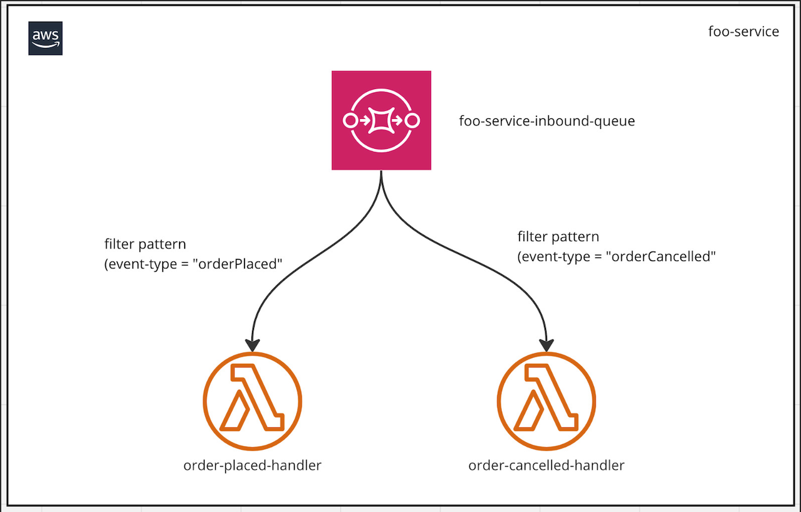
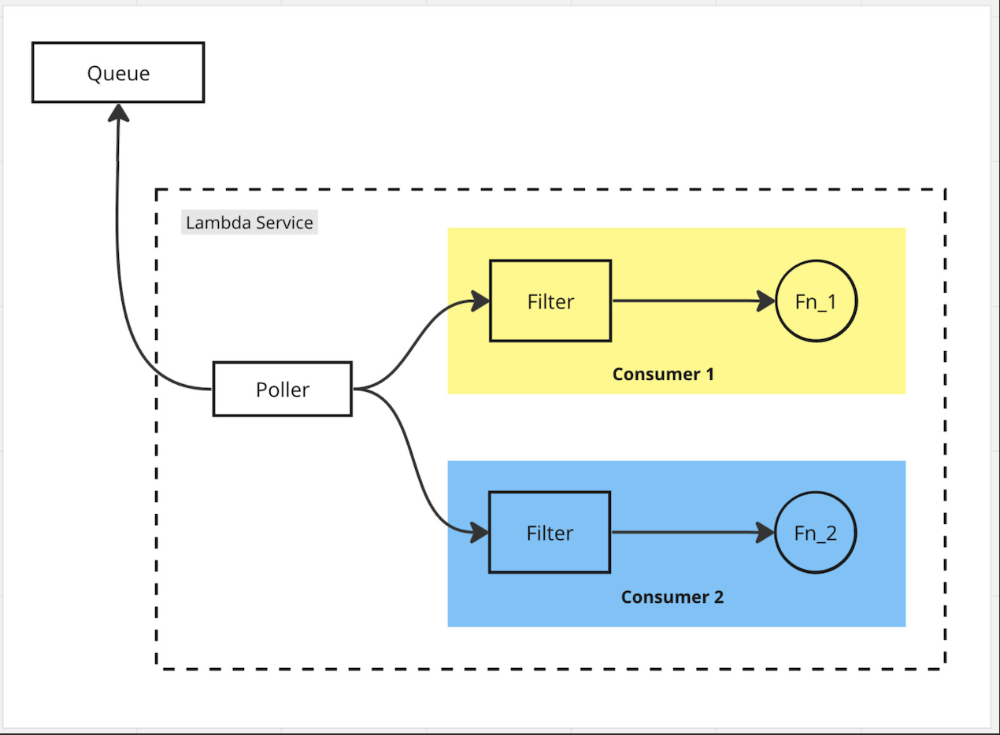

## Watch Out When Using Lambda Event Filtering

I encountered an interesting case when using SQS as an event source for a Lambda function.
I was creating a demo application and attached two Lambda functions to the same queue. 
I used Lambda’s [event filtering](https://docs.aws.amazon.com/lambda/latest/dg/invocation-eventfiltering.html) feature, 
assuming the Lambda service would call the correct function according to the [filter condition](https://docs.aws.amazon.com/lambda/latest/dg/invocation-eventfiltering.html#filtering-SQS).
The following diagram shows the architecture of the application.

I expected the Lambda service to call `order-placed-handler` function for orderPlaced eventType and 
`order-cancelled-handler` function for orderCancelled eventType. However, the actual behaviour is that when the Lambda 
service retrieves a message from the queue, it sends the message to any one of the functions attached to the queue,
and then the filtering step kicks in. If the message meets the filtering criteria, the function is invoked with that message. 
Otherwise, the message is deleted from the queue.

That means the message will not be available to other functions, even though it is capable of processing it, which results in data loss.

### Conclusion

It’s kind of obvious that attaching more than one function (consumer) to the same queue is not ideal in this scenario,
given that only one of the functions gets the chance to process the message. However, the event filtering feature in
Lambda made me think that it would take care of sending the message to the correct destination based on the filtering criteria.

There are other ways to approach the application shown in the first diagram, but the Lambda event filtering is not one of them.
This [blog post](https://www.tecracer.com/blog/2022/01/lambda-sqs-event-filters-may-delete-your-messages-if-youre-not-careful.html) 
explores more details about this topic.
